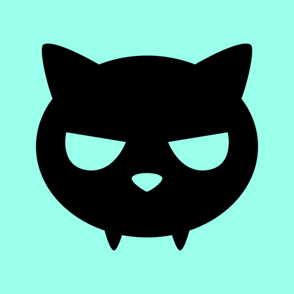

<p align="center">
  <picture>
    
  </picture>
</p>

<h1 align="center">Dedcat Skills</h1>

<p align="center">
  <a href="https://bounce.ded.cat">DedcatBounce</a>
  &nbsp;&middot;&nbsp;
  <a href="https://ded.cat">ded.cat</a>
  &nbsp;&middot;&nbsp;
  <a href="https://dedcat.gitbook.io/">dedcat docs</a>
</p>

AI agent skills for interacting with [Dedcat](https://ded.cat) products.

## Installation

Tell your LLM to install a skill by using the prompt below:

```
install the dcb skill from https://github.com/dedcat-inc/skills
```

## Available Skills

| Skill | Description |
|-------|-------------|
| [dcb](./dcb/SKILL.md) | DedcatBounce agent — interact with the competitive bouncing game on HyperEVM where the last player to bounce before the timer expires wins the pot. Handles wallet setup, game state, bouncing, claiming rewards, and chat via the `dcb` CLI. |
